# 🚀 RentalFlow Backend

RentalFlow is a robust, microservices-based peer-to-peer rental platform. It enables users to list anything from vehicles to property and equipment, handle secure payments via Chapa, and manage the entire rental lifecycle.

## 🏗️ System Architecture

The system follows a microservices architecture, with an API Gateway acting as the single entry point for the frontend, routing requests to the appropriate internal services.

```mermaid
graph TD
    Client["📱 Frontend (Vercel)"]
    Gateway["🛡️ API Gateway (Port 8080)"]
    
    subgraph Services ["Core Services"]
        Auth["👤 Auth Service (8081)"]
        Inv["📦 Inventory Service (8082)"]
        Book["📅 Booking Service (8083)"]
        Pay["💳 Payment Service (8084)"]
        Review["⭐ Review Service (8085)"]
        Notif["🔔 Notification Service (8086)"]
    end
    
    subgraph Data ["Infrastructure"]
        Postgres[(🐘 PostgreSQL)]
        Redis[(⚡ Redis)]
        MQ[("🐰 RabbitMQ")]
    end

    Client -->|REST| Gateway
    Gateway -->|Forward| Auth
    Gateway -->|Forward| Inv
    Gateway -->|Forward| Book
    Gateway -->|Forward| Pay
    Gateway -->|Forward| Review
    Gateway -->|Forward| Notif
    
    Auth & Inv & Book & Pay & Review --> Postgres
    Inv & Book --> Redis
    Book -.->|Publish| MQ
    MQ -.->|Consume| Notif
```



## 🛠️ Microservices Overview

| Service | Responsibility | Technology |
| :--- | :--- | :--- |
| **API Gateway** | Routing, CORS, Rate Limiting, Logging | Go, Gorilla Mux |
| **Auth Service** | JWT Auth, User Profiles, RBAC | Go, Gorm, Postgres |
| **Inventory Service** | Item Management, Search, Availability | Go, Gorm, Postgres, Redis |
| **Booking Service** | Lifecycle management, Agreement PDF | Go, Gorm, Postgres, RabbitMQ |
| **Payment Service** | Chapa Integration, Verification, Refunds | Go, Chapa API |
| **Notification Service** | Email (SMTP), In-app notifications | Go, RabbitMQ, Gorm |
| **Review Service** | Ratings and user feedback | Go, Gorm, Postgres |

## 🚦 Getting Started

### Prerequisites
- Docker & Docker Compose
- Chapa Merchant Account (for API keys)
- Cloudinary Account (for image hosting)

### 📦 Setup with Docker Compose

1. **Clone the repository**
   ```bash
   git clone <repository-url>
   cd RentalFlow
   ```

2. **Configure Environment Variables**
   Copy the example environment file and fill in your credentials:
   ```bash
   cp .env.example .env
   ```
   *Required variables: `JWT_SECRET`, `CHAPA_SECRET_KEY`, `CHAPA_PUBLIC_KEY`, `CLOUDINARY_CLOUD_NAME`, `SMTP_PASSWORD`.*

3. **Start the ecosystem**
   ```bash
   docker-compose up -d
   ```

## 📖 API Documentation

The full API specification is available in OpenAPI 3.0 format.

- **OpenAPI Spec**: [docs/openapi.yaml](./docs/openapi.yaml)
- **Live Gateway**: `https://rentalflow.onrender.com`

## 👨‍💻 Development

For detailed information on each service, please refer to the `README.md` within each service's directory.

---
*Built with ❤️ by the RentalFlow Team.*
