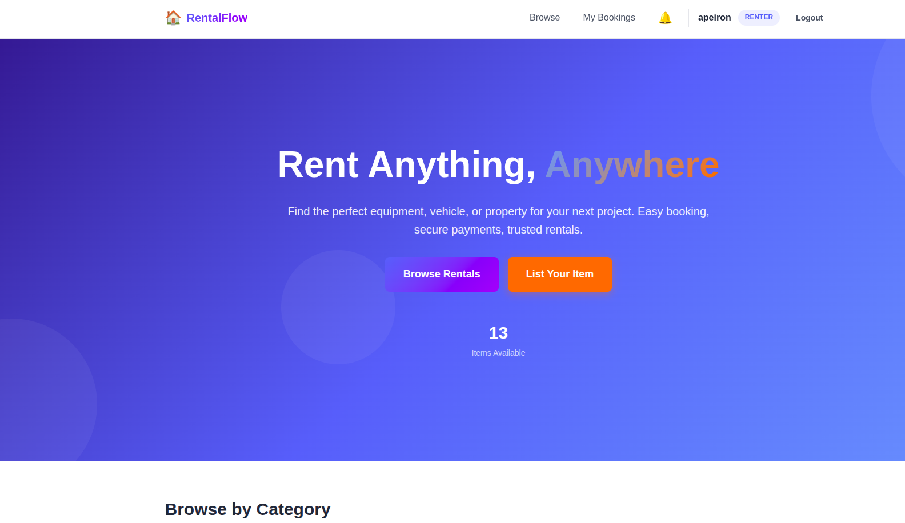
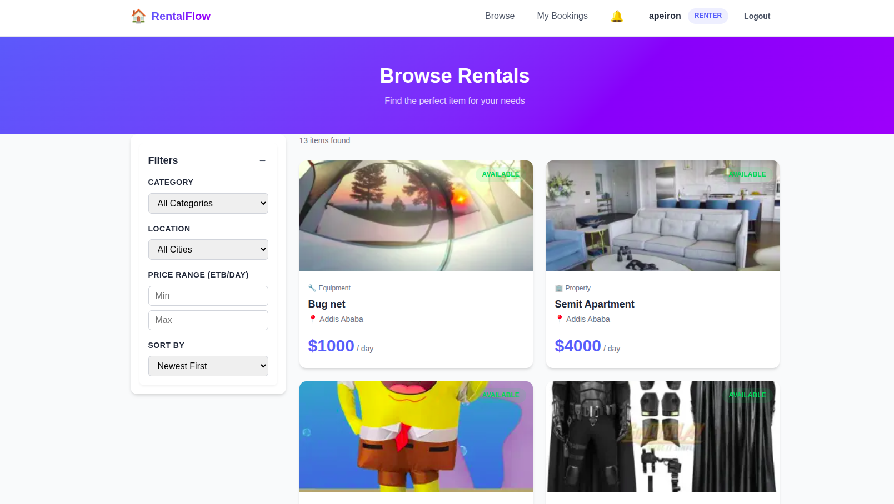
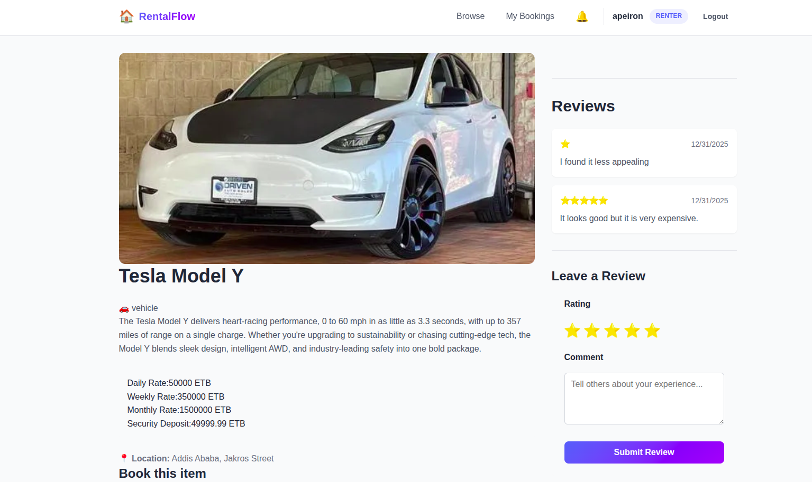
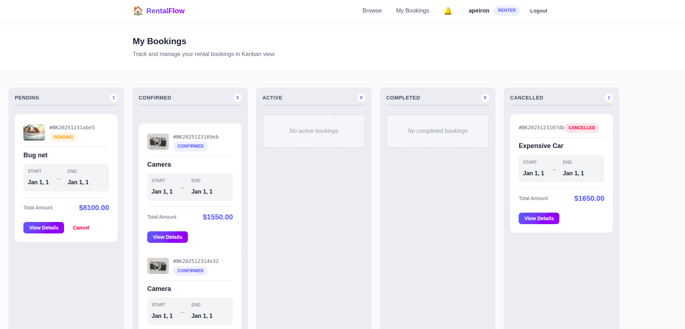
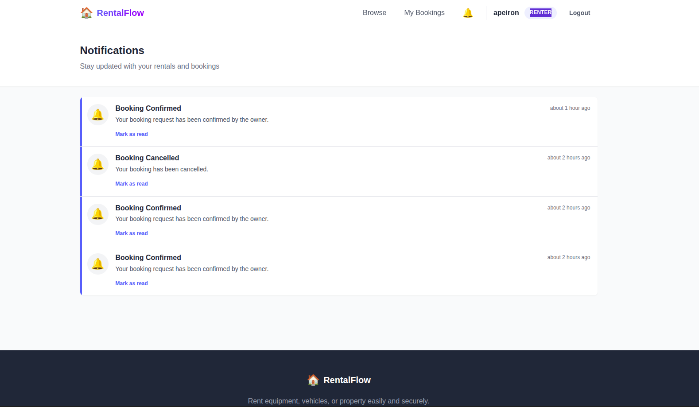

# 🌐 RentalFlow Frontend

A modern, high-performance web interface for the RentalFlow P2P rental platform. Built with a focus on user experience, responsiveness, and aesthetic excellence.

## ✨ Features

- **Dynamic Homepage**: Featured items and easy navigation.
- **Advanced Filtering**: Find exactly what you need with category and city filters.
- **Kanban Booking Management**: Track your rentals (as owner or renter) through intuitive columns.
- **Secure Payments**: Integrated Chapa payment flow with real-time verification.
- **Interactive Profiles**: Manage your listings and personal information.

## 🛠️ Tech Stack

- **Framework**: [React 18](https://reactjs.org/) with [TypeScript](https://www.typescriptlang.org/)
- **Build Tool**: [Vite](https://vitejs.dev/)
- **Styling**: [Tailwind CSS](https://tailwindcss.com/) & Vanilla CSS
- **Animations**: [Framer Motion](https://www.framer.com/motion/)
- **Icons**: [Lucide React](https://lucide.dev/)
- **State/Routing**: React Context, React Router DOM
- **Deployment**: [Vercel](https://vercel.com/)

## 📸 Showcase

> [!NOTE]
> Screenshots are located in the `docs/static/` directory.

| Home Page | Browse Rentals |
| :---: | :---: |
|  |  |

| Item Details | Kanban Bookings |
| :---: | :---: |
|  |  |

| Notifications |
| :---: |
|  |

## 🚀 Getting Started

### Prerequisites
- Node.js (v18 or higher)
- npm or yarn

### Local Setup

1. **Clone and Install**
   ```bash
   git clone <repository-url>
   cd RentalFlow-frontend
   npm install
   ```

2. **Environment Variables**
   Create a `.env` file in the root directory:
   ```env
   VITE_API_URL=http://localhost:8080
   ```

3. **Run Development Server**
   ```bash
   npm run dev
   ```

### 🚢 Deployment

The project is optimized for deployment on **Vercel**. 
- Ensure `VITE_API_URL` is set in your Vercel project environment variables.
- The `vercel.json` file handles SPA routing automatically.

## 📁 Project Structure

- `src/components`: Reusable UI components (Atomic design).
- `src/pages`: Main view components and routing entry points.
- `src/context`: Global state management (Auth, Theme).
- `src/services`: API communication layer.
- `src/assets`: Static images and global styles.

